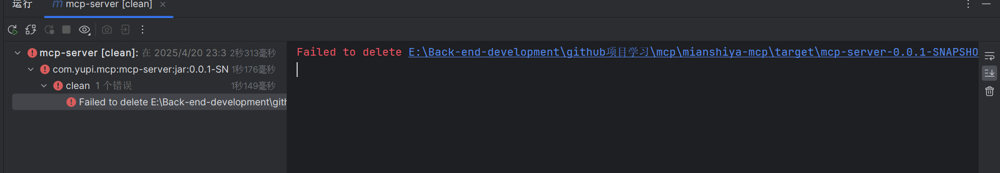

# 删除不了jar包

背景

在删除jar包的时候删除不掉




分析：

jar包正在运行

解决

我并不知道jar包，在哪运行。

可以根据jar包名称 查找

1.查找所有的java运行的程序，并且显示详细信息

```shell
jps -lv
```

2.根据jar名称查找运行的端口

在终端 ctrl + f 数据jar包名称


3.杀死所运行的进程id

```shell
taskkill /F /PID 16668
```


测试， 再次maven clean 成功，当然package 也成功

