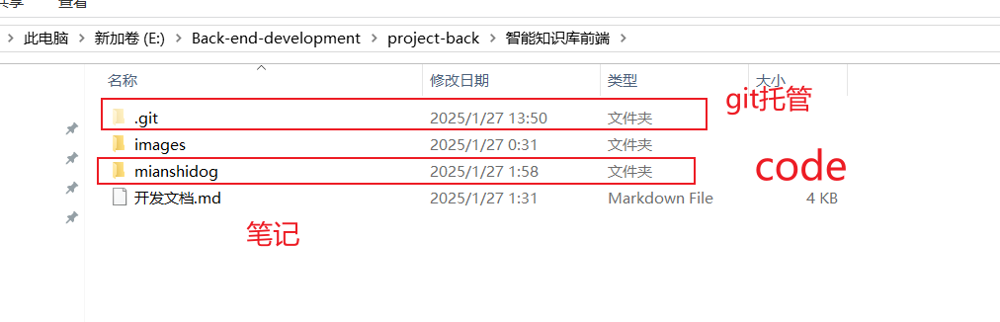

## 双层Git管理项目，github托管显示不正常

1. 背景

在写React项目时，使用Next.js,该项目默认由git托管。但是我有在项目代码外层记笔记的习惯，我就在外层使用了git托管。

目录如下



code 层内也有.git 文件，对其托管。

我没太在意，然后push到远程仓库，发现问题。内存托管的文件不能查看。

经过排查，才注意到有两层.git。

解决方法：

1. 删除内层.git。
2. **清楚内存文件缓存**

由于以及将code层代码通过```git add mianshidog```添加到缓存区，我们仅仅删除内存也就是code层下的`.`git`文件，外层git感知不到内存的变换。所以要清楚缓存

```shell
 git rm --cached "./mianshidog"
```

3. 就可以正常的使用

```shell
git status
git commit -m"xxx"
git push xxx.url
```


