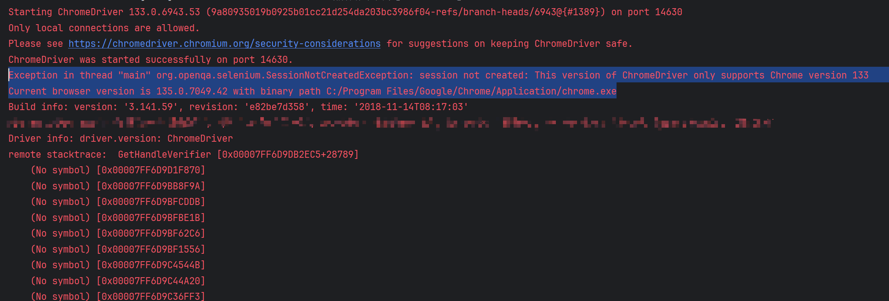
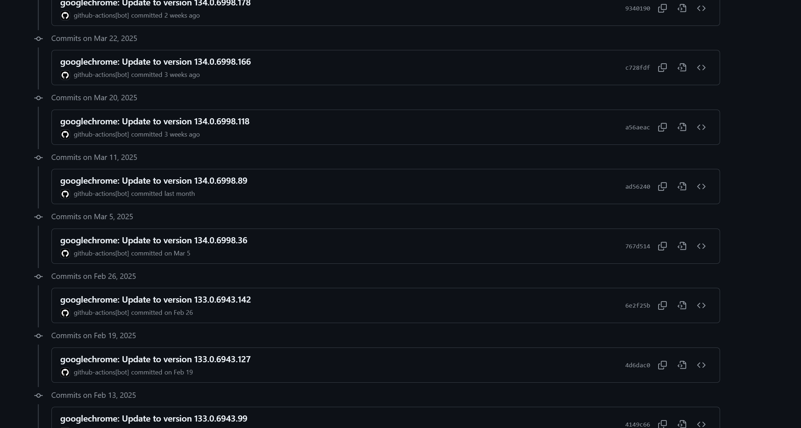
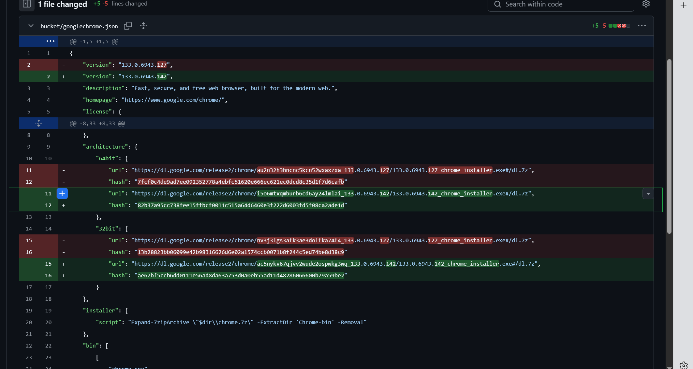

## 谷歌浏览器驱动和浏览器版本不一致问题

背景：在使用的一个项目的时候，之前可以正常使用，但是最近突然不能用了，报错如下


```shell
Exception in thread "main" org.openqa.selenium.SessionNotCreatedException: session not created: This version of ChromeDriver only supports Chrome version 133
Current browser version is 135.0.7049.42 with binary path C:/Program Files/Google/Chrome/Application/chrome.exe
```




原因是，项目中的浏览器驱动和浏览器版本不一致了。

解决办法首先就是，退回到之前版本的浏览器，发现官方并没有提供下载链接。

经过查阅资料，发现了一种官方源的下载方式

网址：[History for bucket/googlechrome.json - ScoopInstaller/Extras](https://github.com/ScoopInstaller/Extras/commits/master/bucket/googlechrome.json)

如图



以我要下载的133.0.694.x为例

我是64位的操作系统，所以直接找到64bit的包，复制绿色框的url：即可下载。



关于自动更新这个问题：删除新版本之后，在下载老版本不会自动更新。