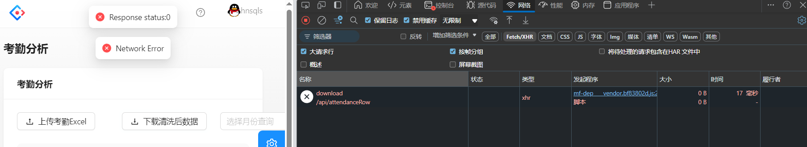
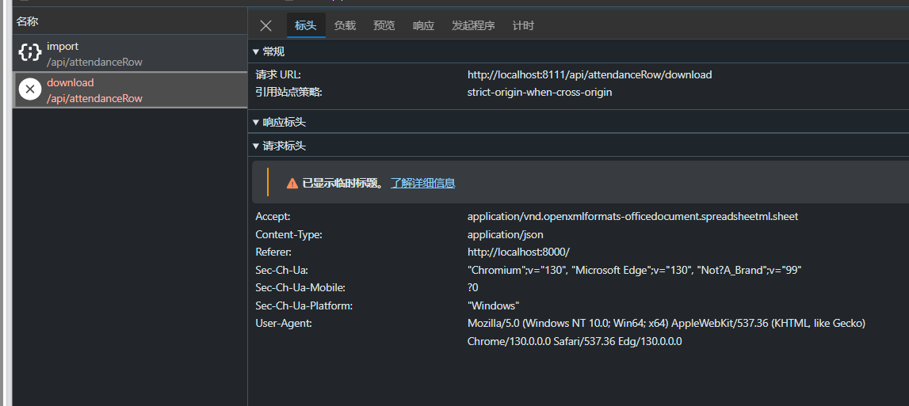
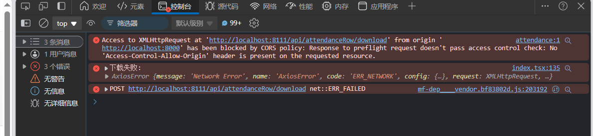
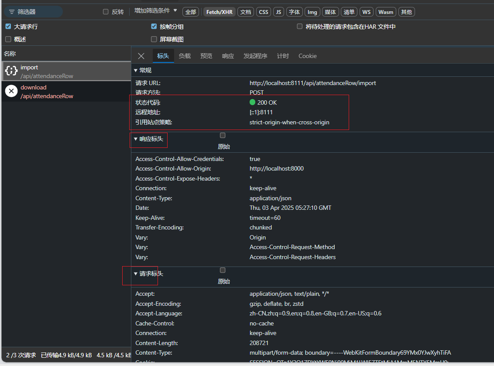
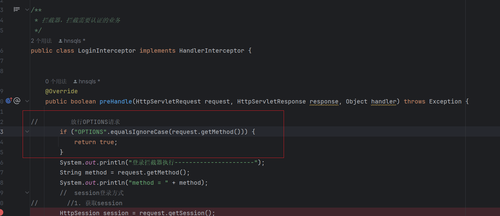

# LS的踩坑经历

## 配置了全局跨域还是会出现跨域问题

先说结论：拦截器影响跨域配置，
场景复现： 前后端分离项目

跨域问题的解决: 在后端写了一个解决跨域的类。 （当然也可以在前端，代理解决跨域 之后可以详细写一下）

全局跨域配置如下。

```java
/**
 * 全局跨域配置
 * 该类用于配置Spring Boot应用的全局跨域资源共享（CORS）策略。
 * 通过实现WebMvcConfigurer接口并重写addCorsMappings方法，可以自定义CORS规则。
 */
@Configuration // 标记该类为配置类，Spring Boot会自动加载并应用该配置
public class CorsConfig implements WebMvcConfigurer {

    @Override
    public void addCorsMappings(CorsRegistry registry) {
        // 配置CORS规则
        registry.addMapping("/**") // 匹配所有路径，即对所有请求应用CORS规则
                // 允许跨域请求携带凭证信息（如Cookies、HTTP认证等）
                .allowCredentials(true)
                // 允许哪些域名访问资源。使用allowedOriginPatterns而不是allowedOrigins，
                // 因为allowedOrigins("*")与allowCredentials(true)冲突。
                // allowedOriginPatterns支持通配符，且可以与allowCredentials(true)一起使用。
                .allowedOriginPatterns("*")
                // 允许的HTTP方法，包括GET、POST、PUT、DELETE和OPTIONS
                .allowedMethods("GET", "POST", "PUT", "DELETE", "OPTIONS")
                // 允许所有请求头
                .allowedHeaders("*")
                // 暴露所有响应头，使客户端可以访问这些头信息
                .exposedHeaders("*");
    }
}
```

我在后端写了跨域配置为什么还会出现跨域问题？ 不自己看控制台的输出还真想不到是跨域的错。







这也没有响应码，正常的请求响应如下。


分析：为什么，我处理了跨域配置，其他请求也检验出跨域配置生效了，但是该接口还是出现了跨域问题。


具体的接口信息如下

```java
/**
     * 下载清洗后的文件，Excel
     * @param ids 考勤记录ID集合
     */
    @PostMapping("/download")
    public void exportExcel(@RequestBody List<Long> ids, HttpServletResponse response) {
        try {
            // 1. 查询数据
            List<AttendanceRaw> attendanceRawList = attendanceRowService.listByIds(ids);

            // 2. 设置响应头
            response.setContentType("application/vnd.openxmlformats-officedocument.spreadsheetml.sheet");
            response.setCharacterEncoding("utf-8");
            String fileName = URLEncoder.encode("考勤清洗数据", StandardCharsets.UTF_8).replaceAll("\\+", "%20");
            response.setHeader("Content-disposition", "attachment;filename=" + fileName + ".xlsx");

            // 3. 直接写入响应流
            EasyExcel.write(response.getOutputStream(), AttendanceRaw.class)
                    .registerWriteHandler(new LongestMatchColumnWidthStyleStrategy())
                    .registerConverter(new CustomDateConverter())
                    .excludeColumnFieldNames(Arrays.asList("id","createTime", "updateTime"))
                    .sheet("考勤清洗数据")
                    .doWrite(attendanceRawList);
            
        } catch (Exception e) {
            response.setContentType("application/json");
            response.setStatus(HttpServletResponse.SC_INTERNAL_SERVER_ERROR);
            try {
                response.getWriter().write("{\"message\":\"导出Excel失败: " + e.getMessage() + "\"}");
            } catch (IOException ex) {
                // 忽略
            }
        }
    }

```


前端

```ts
/** exportExcel POST /api/attendanceRow/download */
export async function exportExcelUsingPost(
  body: number[],
  options?: { [key: string]: any } & { responseType?: 'blob' }
) {
  return request<Blob>('/api/attendanceRow/download', {
    method: 'POST',
    headers: {
      'Content-Type': 'application/json',
    },
    data: body,
    responseType: options?.responseType || 'json',
    ...(options || {}),
  });
}

 const response = await exportExcelUsingPost(recordIds, {
        responseType: 'blob',
        headers: {
          'Accept': 'application/vnd.openxmlformats-officedocument.spreadsheetml.sheet'
        }
      });
```

分析接口，没问题。

至此前后端接口都没问题？为何出现了跨域问题。


经过排查，发现，导致跨域不生效的原因竟然是拦截器。

下面分析一下拦截器是怎么影响跨域的。

我的登录拦截器: session 认证

```java
//@Component  拦截器是非常轻量级的组件，只有再需要时才会被调用

/**
 * 拦截器，拦截需要认证的业务
 */
public class LoginInterceptor implements HandlerInterceptor {


    @Override
    public boolean preHandle(HttpServletRequest request, HttpServletResponse response, Object handler) throws Exception {


        //  session登录方式
//        //1. 获取session
        HttpSession session = request.getSession();
//        // 2. 获取session中的用户
        Object user = session.getAttribute("user");
        if (user == null ) {
            //没有用户信息
            response.setStatus(401);
            response.setContentType("application/json");
            response.setCharacterEncoding("UTF-8");
            response.getWriter().write("{\"code\": 401, \"message\": \"用户未登录\"}");
            return false;
        }

//        //3. todo 保存到ThreadLocal中
//        UserHolder.saveUser((User) user);

        return true;

    }

    // todo ThreadLocal
//    @Override
//    public void afterCompletion(HttpServletRequest request, HttpServletResponse response, Object handler, Exception ex) throws Exception {
//       //移除信息，避免内存泄露
//        UserHolder.removeUser();
//    }
}

```

并且注册

```java
/**
 * webMvc 配置
 */
@Configuration
public class WebMvcConfig implements WebMvcConfigurer {

    /**
     * 添加拦截器
     * @param registry
     */
    @Override
    public void addInterceptors(InterceptorRegistry registry) {

        registry.addInterceptor(new LoginInterceptor())
                .excludePathPatterns(
                        "/doc.html",
                        "/webjars/**",
                        "/swagger-resources",
                        "/swagger-resources/**",
                        "/v3/**",
                        "/favicon.ico",
                        "Mozilla/**",
                        "/druid/**",
                        "/user/register",
                        "/user/login",
                        "/user/logout",
                        "/user/get/login");

    }
}
```

可以看出对于拦截器排除的的请求地址，都会拦截。拦截该请求对该请求进行登录的校验。

那我明明已经登录了，登录拦截器应该会放行才对。

其实不是的，对于非简单的请求，会先发送一个options预先检验请求，这个请求是不携带用户信息的也就是空的数据，仅仅是来监测能该请求能不能发起这个请求，由于没有携带用户的登录信息所以就导致了拦截器拦截。

你说这些干嘛？不对把，跨域和跨域和拦截器有毛关系？我即使被拦截，也就返回拦截的信息，也就是未登录，为什么会直接跨域？

要理清这个问题，首先要理解，跨域处理和拦截器的执行顺序。

顺序如下

```js
用户请求---->跨域处理--->用户登录拦截器-----执行请求--返回resopne
```

所以现在，发起一个非简单的请求，在次请求前会发送一个options请求。

对于已经登录的用户，但是发送的非简单请求（这个接口），会先一发段options请求，这个请求经过跨域处理在经过登录拦截器处理（但是，options不会携带用户信息）所以就在此被拦截，返回拦截的信息，也就是401未登录的信息。但是为什么浏览器显示是跨域的错误呢？

从浏览器的角度触发

+ **浏览器视角**：
  1. 它期望 `OPTIONS` 返回 `200` + `Access-Control-*` 头。
  2. 但实际收到 `401`（且无 CORS 头），违反 CORS 协议。
  3. 浏览器认为“服务器不允许跨域”，直接阻断请求，**甚至不会发送后续 POST**。
+ **开发者视角**：
  + 看似是“登录失效”，实则是 **拦截器干扰了 CORS 流程**，导致浏览器无法完成预检。


emm?不是先经过跨域处理，之后在经过登录拦截器吗？为什么经过了跨域处理返回头中没有`Access-Control-*` 。

这就要说SpringMVC 的 **CORS 处理时机**

**正常流程**（拦截器放行时）：`请求 → 拦截器（返回 true） → 控制器方法 → 响应处理（注入 CORS 头） → 返回响应`

**拦截器阻断流程**：`请求 → 拦截器（返回 false） → 直接返回响应（无 CORS 头）`

所以，就说明了上述，为什么配置了全局跨域，但是还会出现跨域的问题，原因就是拦截器，拦截options请求，导致请求在拦截器就返回，没有添加上跨域的头信息。

解决方法： 在拦截器中放行options 请求,这样让预检操作，能够判断可以发起请求，后续真的发起请求后，在拦截器判断是否登录。

```java
//         放行OPTIONS请求
        if ("OPTIONS".equalsIgnoreCase(request.getMethod())) {
            return true;
        }
```





其他解决方案

直接使用 CorsFilter

```java
@Bean
public CorsFilter corsFilter() {
    UrlBasedCorsConfigurationSource source = new UrlBasedCorsConfigurationSource();
    CorsConfiguration config = new CorsConfiguration();
    config.setAllowCredentials(true);
    config.addAllowedOriginPattern("*");
    config.addAllowedHeader("*");
    config.addAllowedMethod("*");
    source.registerCorsConfiguration("/**", config);
    return new CorsFilter(source);
}
```


其他的解决办法：跨域不在后端解决，直接Nginx解决，或者在前端使用代理解决。