# 双层Git管理项目，github托管显示不正常

1. 背景

在写React项目时，使用Next.js,该项目默认由git托管。但是我有在项目代码外层记笔记的习惯，我就在外层使用了git托管。

目录如下

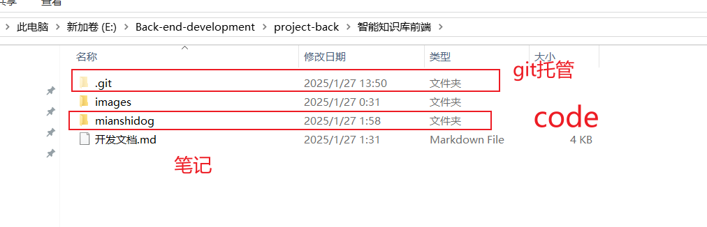

code 层内也有.git 文件，对其托管。

我没太在意，然后push到远程仓库，发现问题。内存托管的文件不能查看。

经过排查，才注意到有两层.git。

解决方法：

1. 删除内层.git。
2. **清楚内存文件缓存**

由于以及将code层代码通过```git add mianshidog```添加到缓存区，我们仅仅删除内存也就是code层下的`.`git`文件，外层git感知不到内存的变换。所以要清楚缓存

```shell
 git rm --cached "./mianshidog"
```

3. 就可以正常的使用

```shell
git status
git commit -m"xxx"
git push xxx.url
```


# Spring boot项目启动找不到启动类

背景： 在github上下载了一个项目，在启动时提示命令行

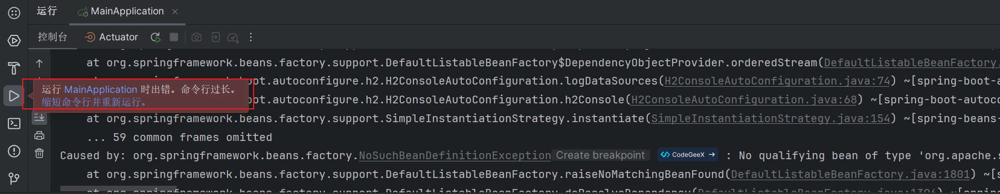

按照提示缩短命令行并运行 ，错误: 找不到或无法加载主类

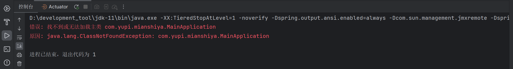

解决方法

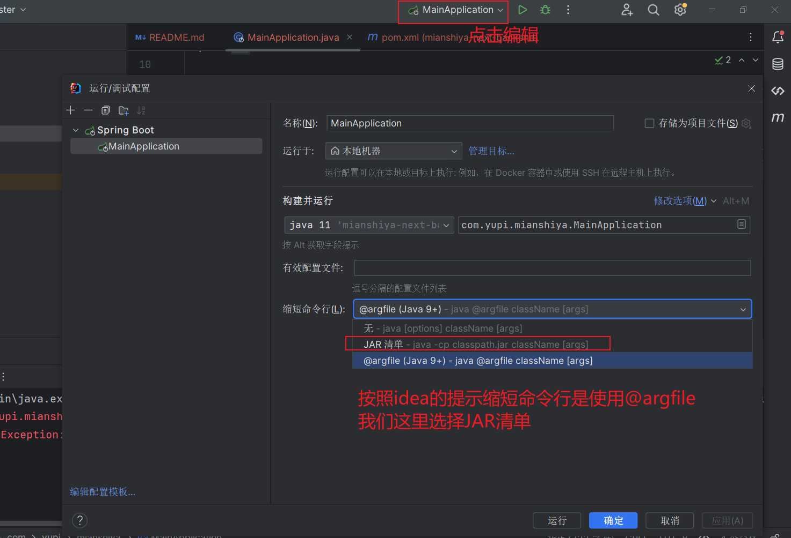

就可以成功了。

原因不知道为何？

#  Github 正常访问但是ping不同也无法进行git操作

原因：在git push 的时候 发现一直push不上去。

```shell
$ git push interview master
ssh: connect to host github.com port 22: Connection timed out
fatal: Could not read from remote repository.

Please make sure you have the correct access rights
and the repository exists.

```

网站可以正常访问，但是主机ping却ping不通

```shell
C:\Users\26611>ping github.com

正在 Ping github.com [20.205.243.166] 具有 32 字节的数据:
请求超时。
请求超时。
请求超时。
请求超时。

20.205.243.166 的 Ping 统计信息:
    数据包: 已发送 = 4，已接收 = 0，丢失 = 4 (100% 丢失)，
```

经过查询资料可以修改将github ip 添加到hosts 文件中

github动态ip[www.github.com - GitHub · Build and ship software on a single, collaborative platform · GitHub](https://www.ipaddress.com/website/www.github.com/)

win10 hosts 文件位置 如下图

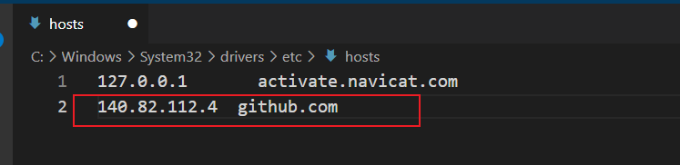

可以ping通

```shell
C:\Users\26611>ping github.com

正在 Ping github.com [140.82.112.4] 具有 32 字节的数据:
来自 140.82.112.4 的回复: 字节=32 时间=291ms TTL=45
来自 140.82.112.4 的回复: 字节=32 时间=430ms TTL=45
来自 140.82.112.4 的回复: 字节=32 时间=299ms TTL=45
来自 140.82.112.4 的回复: 字节=32 时间=318ms TTL=45

140.82.112.4 的 Ping 统计信息:
    数据包: 已发送 = 4，已接收 = 4，丢失 = 0 (0% 丢失)，
往返行程的估计时间(以毫秒为单位):
    最短 = 291ms，最长 = 430ms，平均 = 334ms
```

git操作可以正常操作了

```shell
$ git push interview master
Enumerating objects: 25, done.
Counting objects: 100% (25/25), done.
Delta compression using up to 12 threads
Compressing objects: 100% (22/22), done.
Writing objects: 100% (22/22), 386.20 KiB | 1.69 MiB/s, done.
Total 22 (delta 10), reused 0 (delta 0), pack-reused 0
remote: Resolving deltas: 100% (10/10), completed with 3 local objects.
To github.com:hnsqls/interview.git
   afbfadb..a5d5746  master -> master
```

# 谷歌浏览器驱动和浏览器版本不一致问题

背景：在使用的一个项目的时候，之前可以正常使用，但是最近突然不能用了，报错如下


```shell
Exception in thread "main" org.openqa.selenium.SessionNotCreatedException: session not created: This version of ChromeDriver only supports Chrome version 133
Current browser version is 135.0.7049.42 with binary path C:/Program Files/Google/Chrome/Application/chrome.exe
```

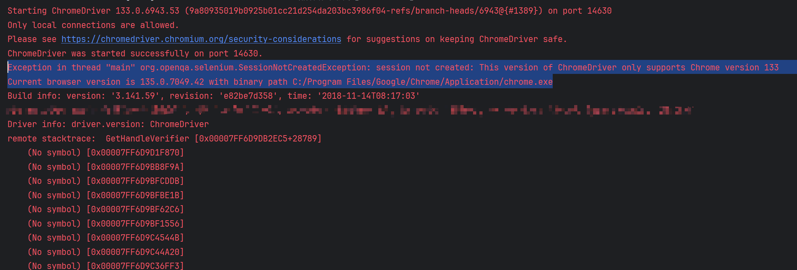


原因是，项目中的浏览器驱动和浏览器版本不一致了。

解决办法首先就是，退回到之前版本的浏览器，发现官方并没有提供下载链接。

经过查阅资料，发现了一种官方源的下载方式

网址：[History for bucket/googlechrome.json - ScoopInstaller/Extras](https://github.com/ScoopInstaller/Extras/commits/master/bucket/googlechrome.json)

如图

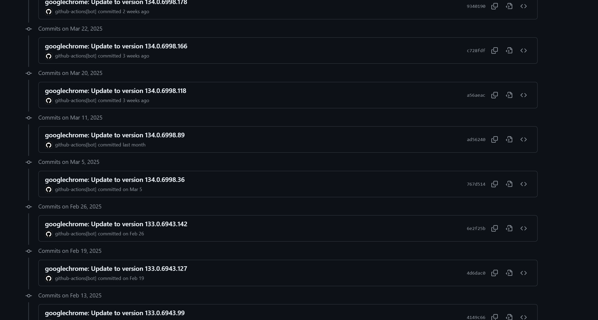

以我要下载的133.0.694.x为例

我是64位的操作系统，所以直接找到64bit的包，复制绿色框的url：即可下载。

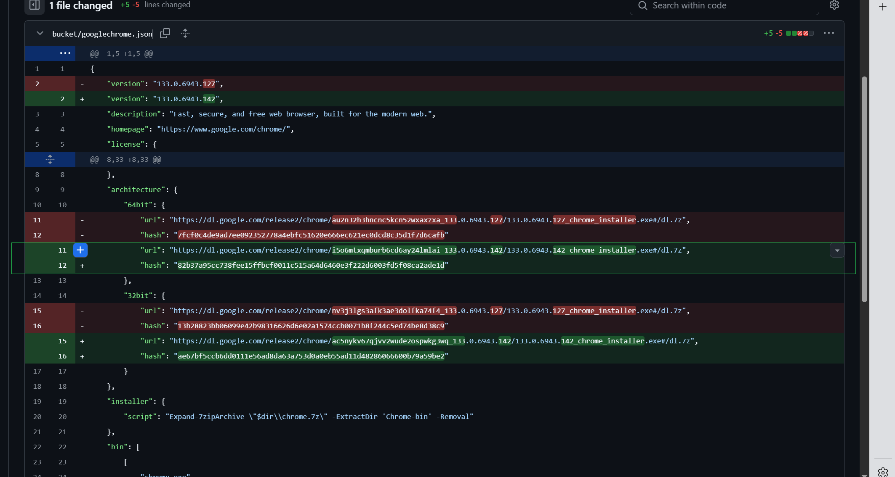

关于自动更新这个问题：删除新版本之后，在下载老版本不会自动更新。


背景

在删除jar包的时候删除不掉


分析：

jar包正在运行

解决

我并不知道jar包，在哪运行。

可以根据jar包名称 查找

1.查找所有的java运行的程序，并且显示详细信息

```shell
jps -lv
```

2.根据jar名称查找运行的端口

在终端 ctrl + f 数据jar包名称


3.杀死所运行的进程id

```shell
taskkill /F /PID 16668
```


测试， 再次maven clean 成功，当然package 也成功

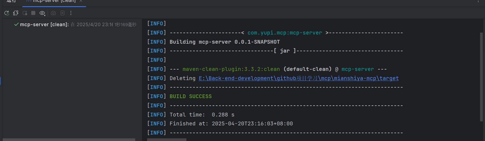


# 删除不了jar包

背景

在删除jar包的时候删除不掉

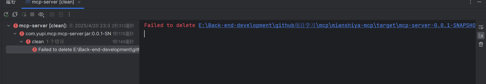


分析：

jar包正在运行

解决

我并不知道jar包，在哪运行。

可以根据jar包名称 查找

1.查找所有的java运行的程序，并且显示详细信息

```shell
jps -lv
```

2.根据jar名称查找运行的端口

在终端 ctrl + f 数据jar包名称

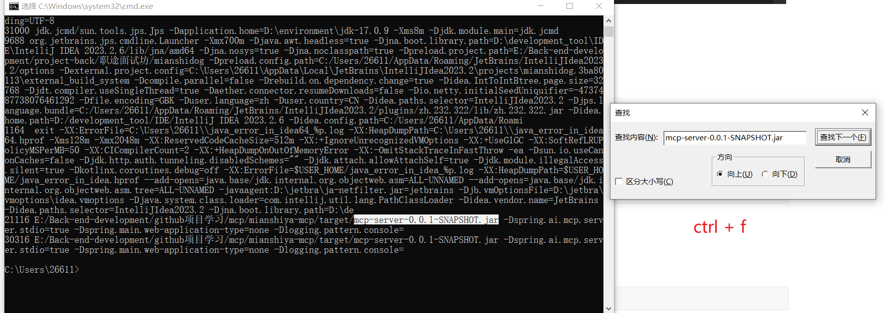

3.杀死所运行的进程id

```shell
taskkill /F /PID 16668
```


测试， 再次maven clean 成功，当然package 也成功

